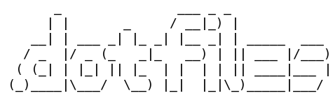

This (/dotfiles) repository has been created as the new home for my configuration dotfiles.  This will mainly be my Vim configuration files and plugins and my Bash configuration files.

I currently house both in my personal DropBox account and this approach has served me well to a point.  I am aiming to update and clean up my Vim configuration and have decided now would be a good time to get my house in order.  However, I have started by porting my initial setup straight from Dropbox so the evolution can be followed.

As a little background I currently develop on two machines, an Arch powered Linux machine and a Windows 7 machine on which I use (G)Vim and Cygwin hence, why cleaning up this configuration will hopefully make my life easier.

This will be an ongoing process over the next few months and I will be updating this README once I have working solutions to various configuration files.
