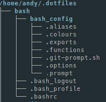

# My .dotfiles & *nix configuration. 

This repository contains the various .dotfiles and configuration settings that I use to configure my *nix based environments.  I currently use [Manjaro i3 Community Edition ](https://manjaro.org/download/community/i3/) across a range of laptops and Virtual Machines.

**Important Note - ** *This repository previously had a custom script to handle the linking and management of files. I have now switched to using [GNU Stow](https://www.gnu.org/software/stow/) to manage the linking of the files in this repository. If you have previously used this repository as a basis for managing your .dotfiles then please update your code based on the new method.*

This repository is designed to be useful to me.  I have spent a number of years trying to tame the files within but I do not focus a lot of time on the code. My prime concern is being able to reconstruct a working, productive environment quickly. If you would find it useful then I have no issue with you forking it and using it to manage your *.dotfiles* and configuration settings.  

If you see something you want to change or fix then I am open to and encourage Pull Requests.

## How it works.

The majority of *.dotfiles* and configuration files are managed by  [GNU Stow](https://www.gnu.org/software/stow/) which is a symlink farm manager. If you do not know what a symlink is then read [this](https://www.howtogeek.com/howto/16226/complete-guide-to-symbolic-links-symlinks-on-windows-or-linux/) article for a complete guide. I also suggest you read the GNU Stow page as well to give some context.

All *.dotfiles* or configuration files for an application are stored within a directory in the *.dotfiles* directory. The directory for each application should be named for the associated application, for example _.dotfiles/bash/_ or _.dotfiles/zsh/_. The directory structure from the home directory should be maintained in these application directories as  [GNU Stow](https://www.gnu.org/software/stow/) will reconstruct the structure when it is executed.

Any further configuration files sourced by the main .*dotfiles* such as aliases or functions are stored in a sub-directory of the application directory. This directory is named _application_config_ for example _.dotfiles/bash/bash_config_.



To restore the *.dofiles* for a particular application you can use Stow and tell it which application to restore.

```shell
$ stow bash
```

Any other files that for whatever reason can not be handled by Stow or which provide custom functionality are prefixed with *Initialise*. These files can be run individually.

# Getting Started


In order to get started you should clone this repository with the following command:

```
git clone --recursive https://github.com/andy-crouch/dotfiles.git ~/.dotfiles
```

This will download **my** dotfiles and settings.  If you decide to fork this repository then my settings will show you how I have structured the files and settings and give you a boilerplate repository to use for your own.  

## Prerequisites

I use [Zsh](https://www.zsh.org/) as my shell of choice. There is a basic bash setup included in the repository but I install Zsh as soon as I can on a machine. I find Zsh is more user friendly and productive than bash and [this](https://linuxhint.com/differences_between_bash_zsh/) article covers some of the benefits.

I use [Oh My Zsh](https://ohmyz.sh/) which is "*an open source, community-driven framework for managing your zsh configuration.*"  The projects repository is a submodule to this project and will be installed on cloning.

On top of Oh My Zsh I then add the [Powerlevel 10k](https://github.com/romkatv/powerlevel10k) theme to create a useful prompt.

## Installing

This section is currently being updated to add an initialise script to automatically run all restore commands in on orchestrated manner.

Check back soon.

# Running the tests

The ***test.sh*** script in the root of the .dofiles/ directory will use [shellchecker](https://github.com/koalaman/shellcheck) to catch issues with any scripts.  To run the script, run:

```cd ~/.dotfiles
cd ~/.dotfiles
./test.sh
```

Any errors or linting issues will be streamed to the console.

# Applications, Utilities & Themes

* arandr - Used to switch between screen layouts when moving between multiple monitors. Each configuration is stored in the *~/.dotfiles/arandr* directory.
* bash - Although I have switched permenantly to zsh for my terminal experience I have an old bash configuration available in the *~/.dotfiles/bash* directory.
* zsh - Shell of choice and mixed with Oh My Zsh and the Powerlevel 10k theme. If you disable auto updating in Oh My Shell you should periodically pull latest in the *~/.dotfiles/zsh/.oh-my-zsh* directory. All zsh related configuration is stored in the *~.dotfiles/zsh* directory.

# Contributing

Please read [CONTRIBUTING.md](CONTRIBUTING.md) for details on the code of conduct, and the process for submitting pull requests.

# Authors

* **Andy Crouch** - [Email](mailto:email@amcrou.ch) | [Twitter](https://twitter.com/amcrouch) 

# License

This project is licensed under the MIT License - see the [LICENSE.md](LICENSE.md) file for details

# Acknowledgements

* Jess Frazelle [dotfiles](https://github.com/jessfraz/dotfiles) - Excellent reference scripts. Unashamedly stole her script testing script. I highly recommend you follow her on [twitter](https://twitter.com/jessfraz?lang=en). 

